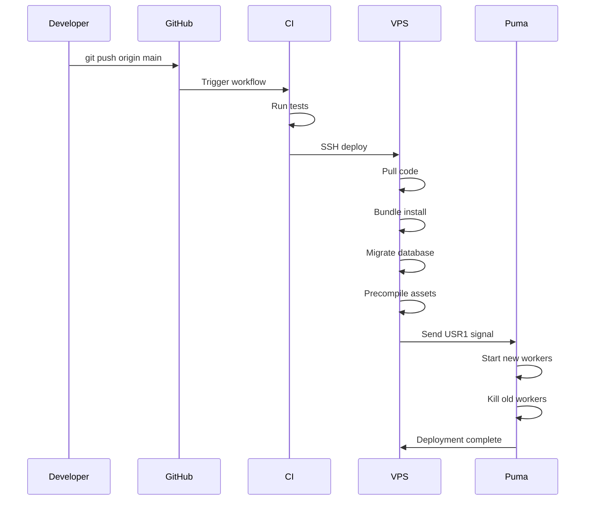

# Deployment & Workflow Documentation

**Project:** CORE - Rails 8 Monolith
**Updated:** 2025-11-03
**Maintainer:** RECTOR

---

## 1. Slash Command Enhancements (`/work:story`)

### What Changed

✅ **Duplicate Detection** - Checks if work story already exists before generating
✅ **Database Integration** - Automatically saves to local database
✅ **User Choice on Duplicates** - Options to replace, create new version, or cancel
✅ **Production Deployment Guidance** - Clear instructions for syncing to production

### New Workflow

```bash
# Run the slash command
/work:story https://github.com/RECTOR-LABS/some-repo

# 1. Validates URL format
# 2. Checks for existing story in database
# 3. If duplicate exists:
#    → Shows existing story details
#    → Asks: Replace (1) | New version (2) | Cancel (3)
# 4. Generates story from GitHub data
# 5. Saves to LOCAL database automatically
# 6. Shows success confirmation + local URL
# 7. Provides production deployment instructions
```

### Handling Duplicates

**Scenario 1: First time for repo**
```
✅ No existing story found
→ Generates and saves new work
→ /work/repo-name
```

**Scenario 2: Story already exists**
```
⚠️ Work story already exists for this repository!

Repository: RECTOR-LABS/core
Existing story: "CORE"
URL: /work/core
Created: 2 days ago

What would you like to do?

1. Replace existing story (overwrites current content)
2. Create new version with different slug (keeps both)
3. Cancel and keep existing story

Your choice (1/2/3):
```

**Option 1 - Replace:**
- Updates existing Work record in-place
- Same slug, same URL
- Story content replaced

**Option 2 - New Version:**
- Creates new Work record
- New slug: `core-v2` or `core-2025`
- Both stories exist side-by-side

**Option 3 - Cancel:**
- Stops execution
- No changes made

### Local vs Production

**Local (Development):**
- Slash command saves directly to local PostgreSQL database
- Test immediately at `http://localhost:3000/work/[slug]`
- No manual DB commands needed

**Production (Deployment):**

After slash command completes locally:

**Option A (Recommended): Update seeds.rb**
```bash
# 1. Edit db/seeds.rb with new work
# 2. Commit and push to main
git add db/seeds.rb
git commit -m "feat: Add work story for [project]"
git push origin main

# 3. SSH to production and seed
ssh core << 'ENDSSH'
cd ~/apps/core
export PATH="$HOME/.rbenv/bin:$PATH"
eval "$(rbenv init - bash)"
export $(cat .env | grep -v '^#' | xargs)
RAILS_ENV=production bin/rails db:seed
ENDSSH
```

**Option B (Quick): Manual Rails runner on production**
```bash
# SSH and create directly
ssh core << 'ENDSSH'
cd ~/apps/core
export PATH="$HOME/.rbenv/bin:$PATH"
eval "$(rbenv init - bash)"
export $(cat .env | grep -v '^#' | xargs)
RAILS_ENV=production bin/rails runner "
  Work.create!(
    title: 'Project Name',
    slug: 'project-name',
    story: <<~MARKDOWN
      # Story content here
    MARKDOWN,
    # ... rest of attributes
  )
"
ENDSSH
```

---

## 2. Current Deployment Strategy

### Type: **Phased Restart** (Zero-Downtime)

**What You Have:**

✅ **Zero-downtime deployments**
✅ **Graceful worker restarts**
✅ **Automatic recovery on failure**
❌ **No blue-green environments**
❌ **No automatic rollback**
❌ **No pre-deployment health checks**

### Architecture

```
┌─────────────────────────────────────────────────┐
│  GitHub Actions (CI/CD)                         │
│  ├─ Lint, Test, Security Scan                   │
│  └─ Deploy on main push                          │
└─────────────────┬───────────────────────────────┘
                  │
                  v
┌─────────────────────────────────────────────────┐
│  VPS (176.222.53.185)                           │
│  User: core                                      │
│  ├─ Pull latest code (git reset --hard)         │
│  ├─ Bundle install                               │
│  ├─ Assets precompile                            │
│  ├─ Database migrations                          │
│  └─ Puma reload (systemctl reload core-puma)    │
└─────────────────────────────────────────────────┘
```

### Puma Configuration

**Cluster Mode:**
- 2 worker processes
- 3 threads per worker
- Preload app for memory efficiency

**Graceful Reload (USR1 Signal):**
```
1. New workers start with updated code
2. Old workers finish current requests
3. Old workers shutdown gracefully
4. No dropped connections
```

**Service Configuration:**
```systemd
ExecReload=/bin/kill -USR1 $MAINPID
Restart=always
RestartSec=10
```

### Deployment Flow



**Average Deployment Time:** 30-45 seconds

### What's Missing (Blue-Green)

**Blue-Green would add:**
- Two identical production environments
- Traffic switch between blue/green
- Quick rollback by switching back
- Health checks before switching
- Zero risk during deployment

**Cost of Blue-Green:**
- 2x infrastructure cost
- More complex deployment pipeline
- Database migration complexity
- Not needed for solo projects

### Rollback Strategy (Current)

**If deployment breaks:**

**Option 1: Git revert + redeploy**
```bash
git revert HEAD
git push origin main
# CI/CD auto-deploys previous version
```

**Option 2: Manual rollback**
```bash
ssh core
cd ~/apps/core
git reset --hard <previous-commit>
bundle install
RAILS_ENV=production bin/rails db:migrate
sudo systemctl reload core-puma
```

**Downtime during rollback:** ~1-2 minutes

---

## 3. Recommendations

### Current Setup is Good For:
- ✅ Solo developer projects
- ✅ Low-to-medium traffic
- ✅ Fast iteration speed
- ✅ Cost efficiency

### Consider Blue-Green When:
- Traffic is critical (thousands of concurrent users)
- Zero-tolerance for downtime
- Need instant rollback
- Have budget for 2x infrastructure

### Immediate Improvements (Optional)

**1. Add Health Checks:**
```yaml
# In .github/workflows/deploy.yml
- name: Health check
  run: |
    for i in {1..10}; do
      if curl -f https://rectorspace.com/up; then
        echo "Health check passed"
        exit 0
      fi
      sleep 3
    done
    echo "Health check failed"
    exit 1
```

**2. Add Deployment Tagging:**
```bash
# Tag each production deploy
git tag -a "v$(date +%Y%m%d-%H%M%S)" -m "Production deploy"
git push --tags
```

**3. Keep Last 5 Releases:**
```bash
# On VPS, keep recent commits
git reflog expire --expire=30.days --all
git gc --prune=30.days
```

### Kamal Deployment (Future Option)

The Gemfile includes Kamal - Rails' official Docker deployment tool.

**Benefits:**
- Blue-green built-in
- Multi-server support
- SSL auto-renewal
- Asset management

**Setup if interested:**
```bash
kamal init
kamal setup
kamal deploy
```

But current approach works great for your scale.

---

## 4. Quick Reference

### Test Locally
```bash
RBENV_VERSION=3.2.2 bin/rails server
# Visit http://localhost:3000/work
```

### Deploy to Production
```bash
git push origin main
# GitHub Actions handles rest
```

### Check Production Status
```bash
ssh core "sudo systemctl status core-puma"
```

### Manual Production Seed
```bash
ssh core << 'ENDSSH'
cd ~/apps/core
export PATH="$HOME/.rbenv/bin:$PATH"
eval "$(rbenv init - bash)"
export $(cat .env | grep -v '^#' | xargs)
RAILS_ENV=production bin/rails db:seed
ENDSSH
```

### View Production Logs
```bash
ssh core "tail -f ~/apps/core/log/production.log"
```

---

## Summary

**Your Questions Answered:**

1. **Slash command database interaction**: ✅ Now saves to local DB automatically, with production deployment guidance
2. **Blue-green deployment**: ❌ Current setup is phased restart (zero-downtime but no blue-green fallback)
3. **Duplicate validation**: ✅ Command now checks for existing stories and offers replace/new/cancel options

**Current deployment is solid for:**
- Solo projects
- Fast iteration
- Zero-downtime updates
- Cost efficiency

**Upgrade to blue-green if:**
- High traffic (1000+ concurrent)
- Mission-critical uptime
- Instant rollback needed
- Budget allows 2x infra

**For now**: Your deployment strategy is appropriate and working well! 🚀

---

**Building for Eternity** | RECTOR LABS | 2025
